# Homework Submission

**Họ tên:** Nguyễn Thị Huyền

## Hướng dẫn chạy

Do sử dụng database PostgreSQL lưu trữ online trên Neon, nên sử dụng key có sẵn trong file .env.example để kết nối database.

1. Clone repository về máy
2. cd homeworks/submissions/assets-api
3. go mod tidy
4. copy .env.example .env
5. go run cmd/server/main.go

## Các bài đã hoàn thành

- [x] Bài 1: Statistics APIs
      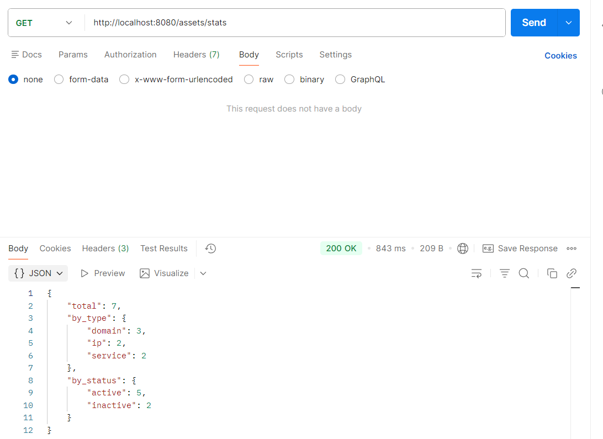
      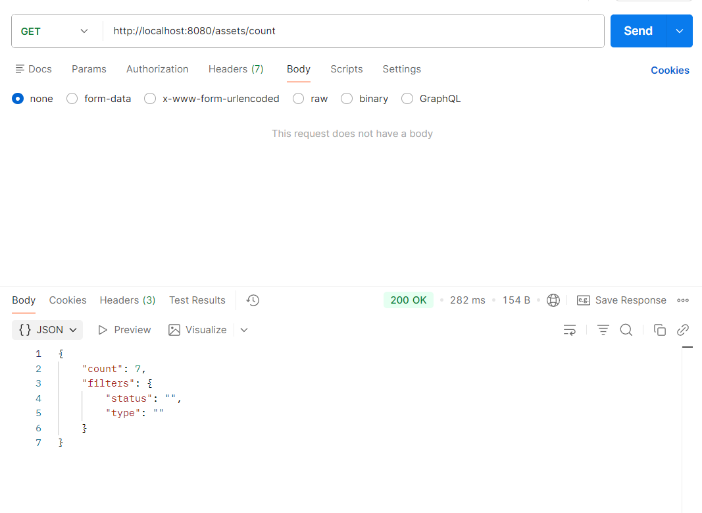
      
      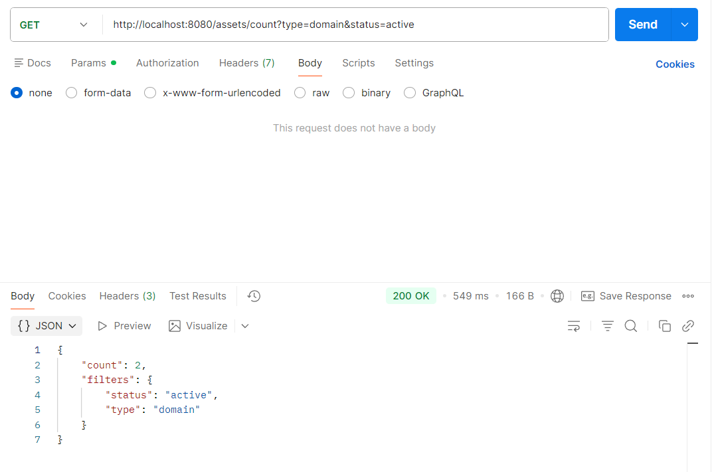
- [x] Bài 2: Batch Create
      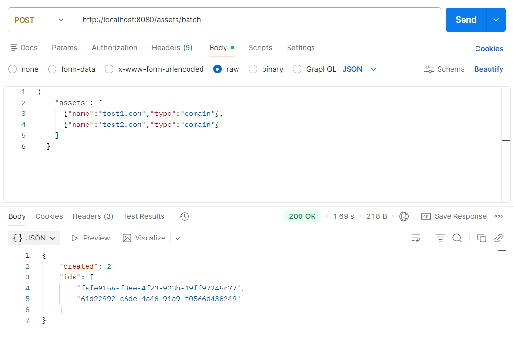
      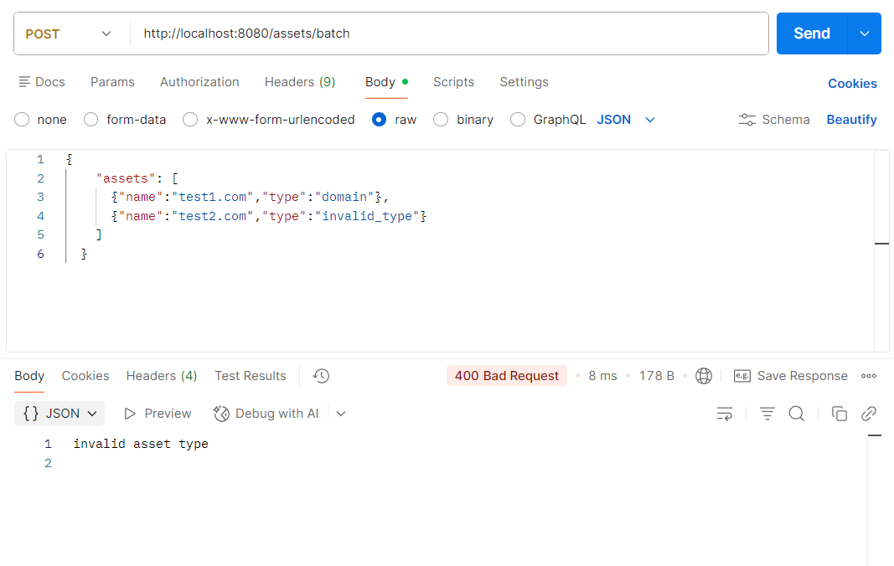
- [x] Bài 3: Batch Delete
      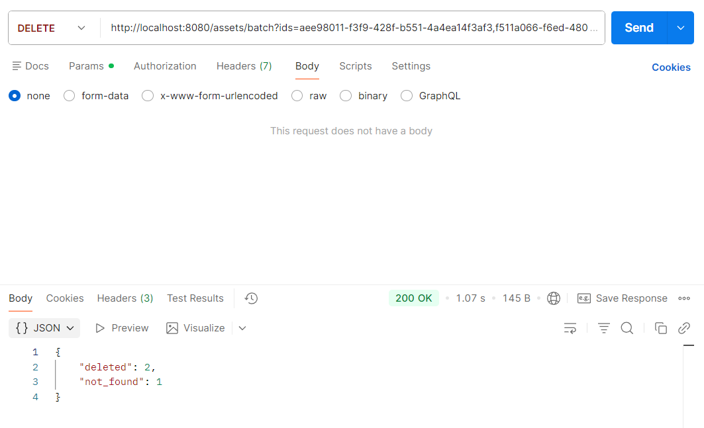

- [x] Bài 4: Connection Retry
      Khi thử viết sai mật khẩu database, API sẽ trả về lỗi kết nối. Sau khi sửa lại mật khẩu đúng, API sẽ tự động kết nối lại và hoạt động bình thường.
      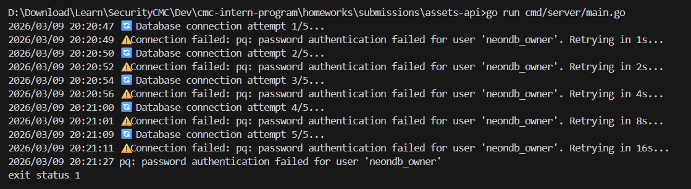
- [x] Bài 5: Health Check
      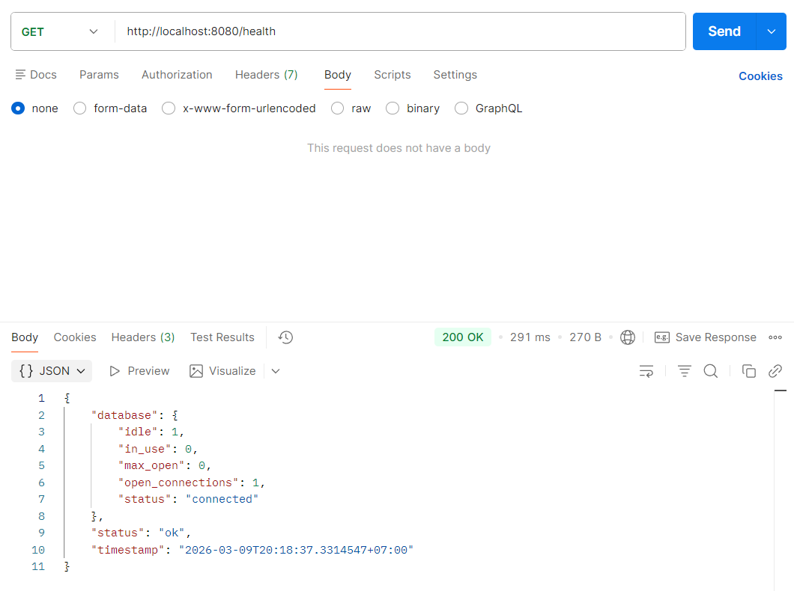
- [x] Bài 6: Pagination (Bonus)
      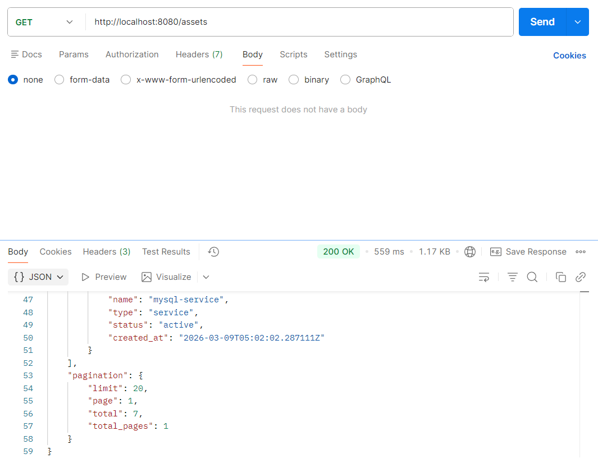
      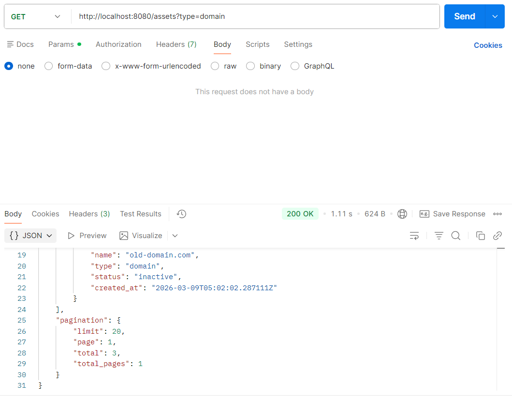
      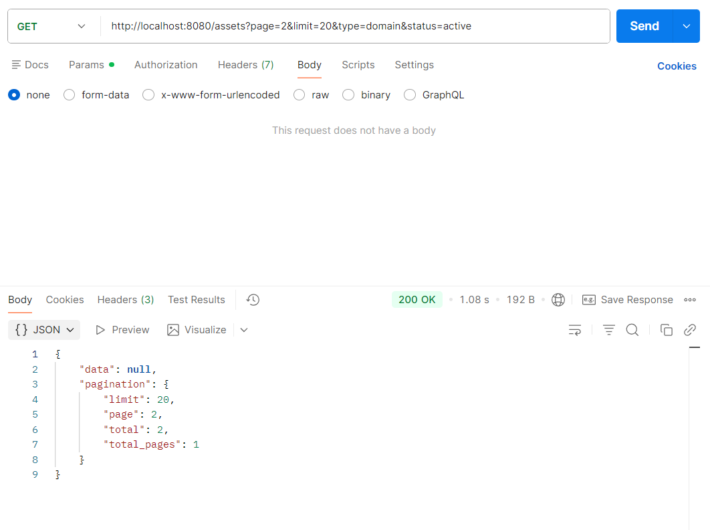
- [x] Bài 7: Search (Bonus)
      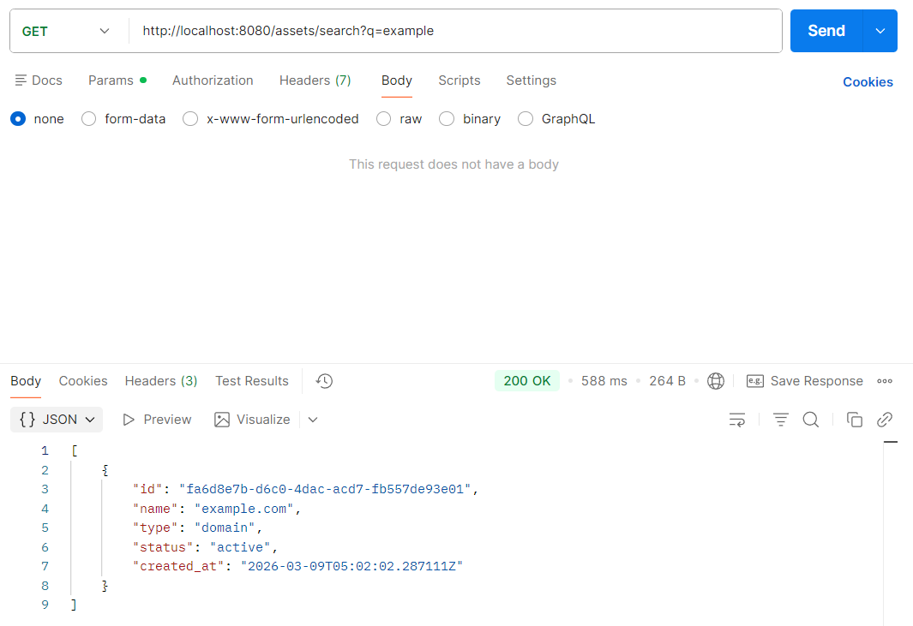
      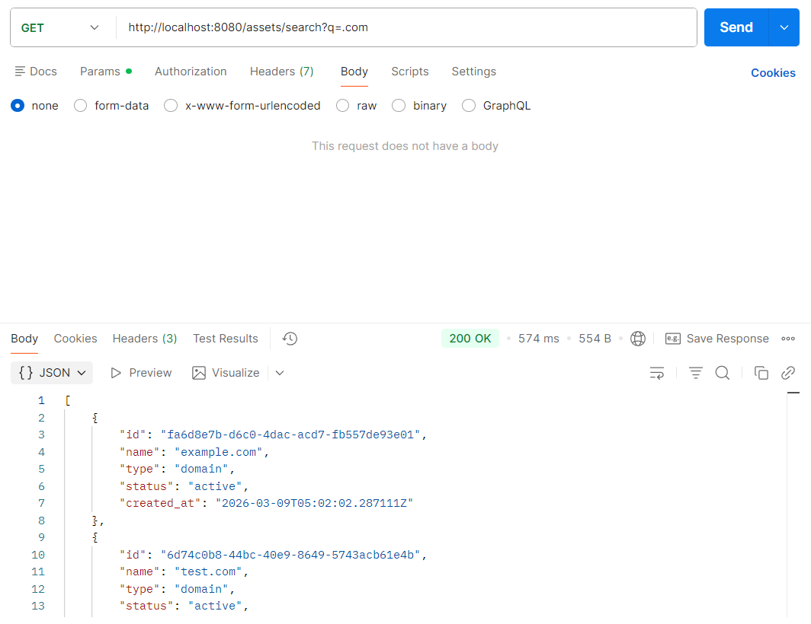
      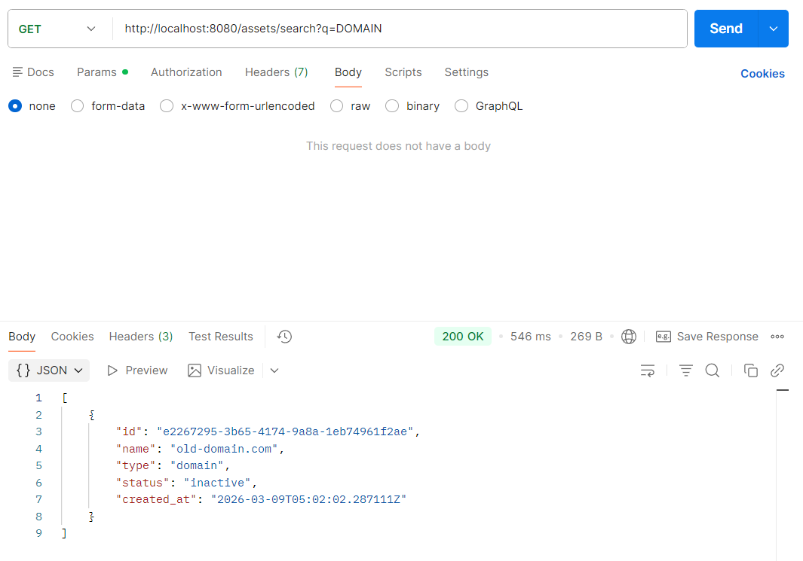
